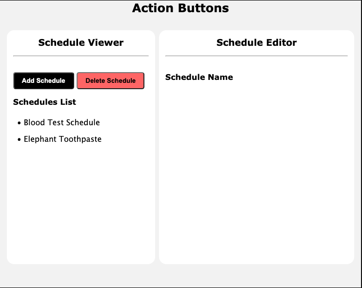
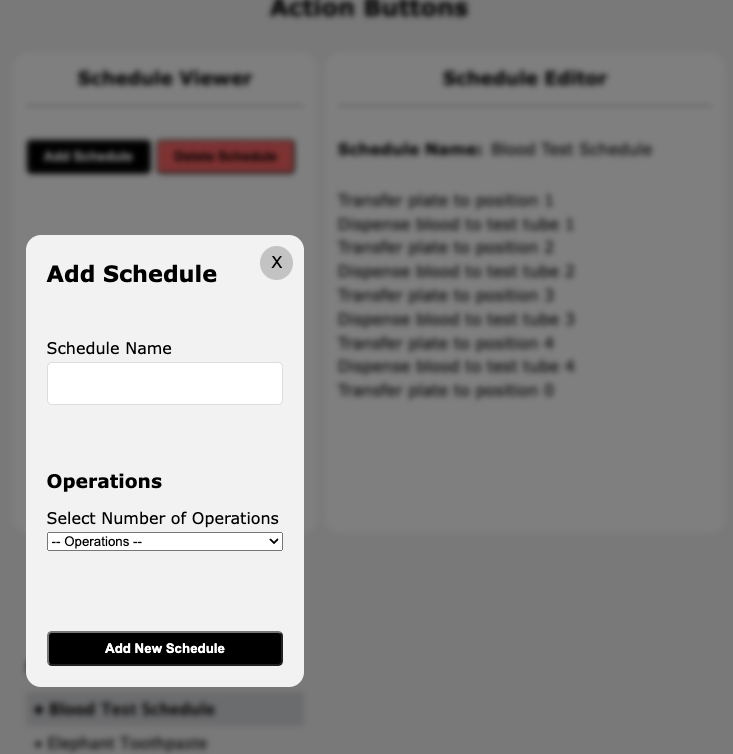
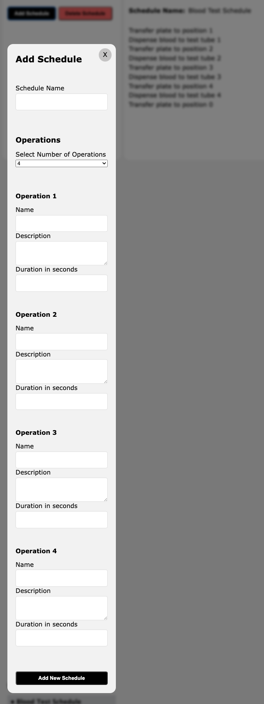
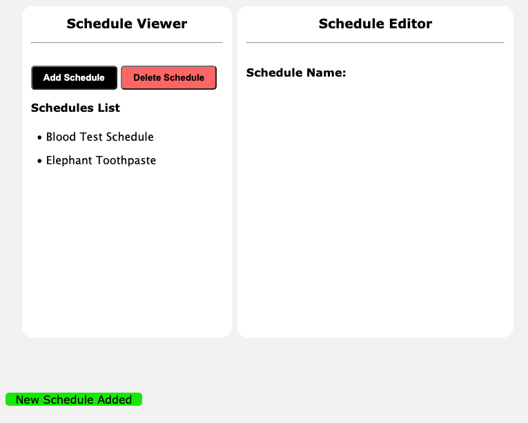
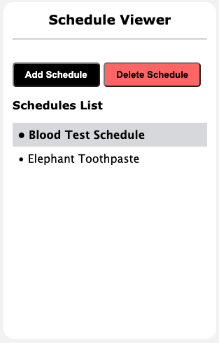
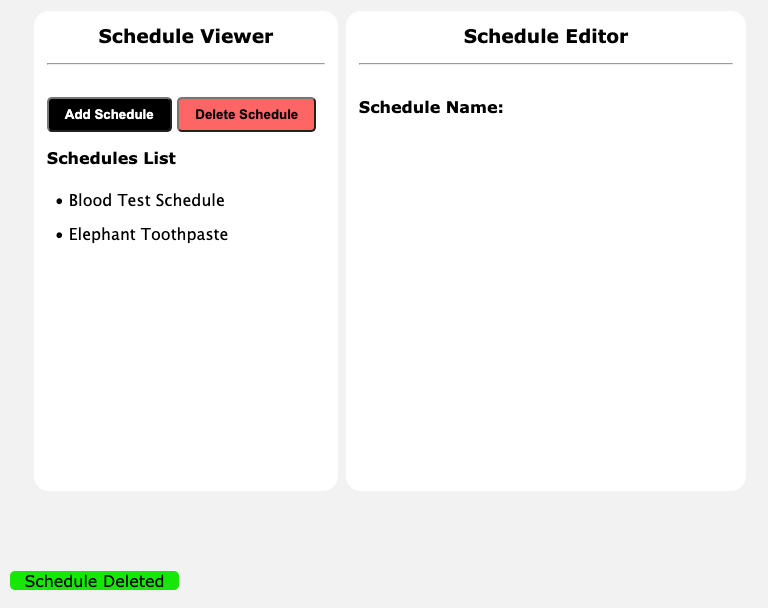
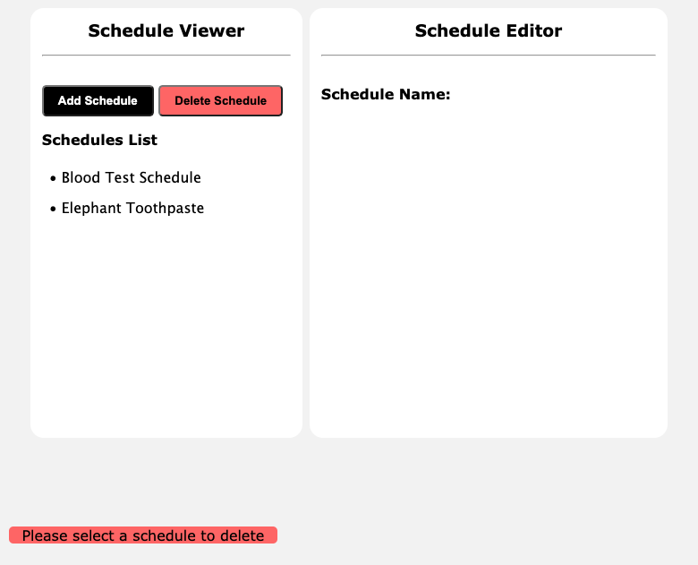
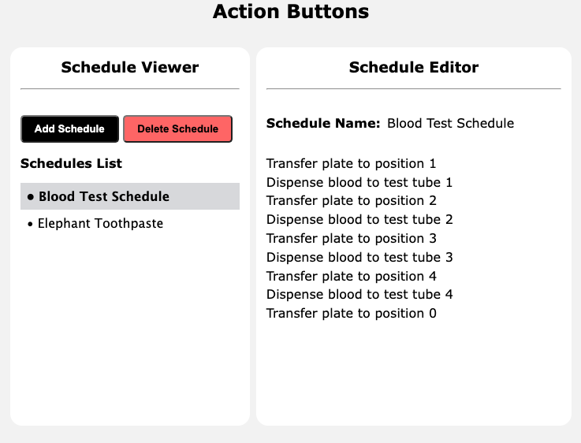

# Lab Automation Scheduler Software

## Description

The Lab Automation Scheduler Software offers seamless task automation for laboratory robots. Think of those sophisticated lab machines responsible for handling test tubes and dispensing blood samples; they rely on precisely orchestrated operations to function effectively. My software serves as the backbone, facilitating the smooth execution of these tasks.

Featuring an intuitive user interface, our software simplifies the scheduling process. With just a few clicks, users can select from a range of pre-defined schedules, enabling lab robots to effortlessly carry out their daily routines. From managing sample handling to ensuring timely analyses, our software streamlines laboratory operations, enhancing efficiency and productivity.

## Technologies Used

In crafting this project, I adhered to a philosophy that prioritizes simplicity in my development environment. I believe that simplicity fosters clarity and efficiency, ultimately resulting in a more robust solution.

The technologies include:

- **HTML:** The foundation of web development, providing structure to my project's content.
- **CSS:** Empowering me to style and enhance the visual presentation of my application.
- **TypeScript:** A superset of JavaScript, selected for its ability to augment project safety. By introducing static typing, TypeScript furnishes me with a shield against runtime errors. Although it may demand additional development time, I view this investment as integral to ensuring the reliability and stability of my software.
- **Testing:** I chose **Jest** for testing because I already have experience writing tests using this technology.

## Installing and Running the Project

To begin, open your terminal application and navigate to the directory where you'd like to store the project.

Next, proceed with the following steps:

1. Clone the project repository by running the following command:

```bash
git clone https://github.com/Cat4848/scheduler
```

2. Enter the project directory:

```bash
cd scheduler
```

3. Install the project dependencies:

```bash
npm install
```

4. Start the development server:

```bash
npm run dev
```

5. Open your web browser and paste the following URL into the address bar:

```
http://localhost:3000
```

Once done, you should be greeted with the following project interface. Happy exploring!



## Features Overview

Let's delve into what our program has to offer.

The interface is split into two distinct sections:

1. Schedule Viewer
2. Schedule Editor

## Schedule Viewer

### Schedules List

Underneath the "Schedules List" header, you'll find a comprehensive display of available task schedules for your lab robot. Each schedule is marked with a bullet point for easy identification.

### Adding a Schedule

To introduce a new schedule, simply click the "Add Schedule" button. Upon clicking, a modal will appear, presenting a form tailored for adding a new schedule.



When you select the number of operations from the dropdown menu, the modal dynamically expands, revealing the requisite fields for each operation. Expect to see as many sets of new operations as the number selected from the dropdown menu.



To successfully add a new schedule, complete the following mandatory fields:

- **Schedule Name:** Positioned at the modal's top.
- **Number of Operations:** Choose from the dropdown menu.
- **Operations:** Include Name, Description, and Duration for each operation.

After successfully adding a new schedule, a confirmation message will appear at the bottom of the main panels, similar to the example shown below:



### Exiting the Modal

To close the modal, you have two options:

1. Click the "X" button positioned at the top right corner of the modal.

2. Click anywhere outside the modal where the surrounding area appears blurred. This action will also close the modal.

### Deleting a Schedule

To remove a schedule, please follow these steps:

1. **Select Schedule:** Navigate to the "Schedules List" section and choose the schedule you wish to delete by clicking on its name. The selected schedule will be visually highlighted for clarity.



2. **Click the "Delete Schedule" Button:** Once you've selected the desired schedule, simply click the "Delete Schedule" button. This action will promptly remove the selected schedule from the list.

After successfully deleting a new schedule, a confirmation message will appear at the bottom of the main panels, similar to the example shown below:



### Delete Error

If attempting to delete a schedule without first selecting one, an error message will appear below the main panels, similar to the example below:



## Schedule Editor Section

Currently, this section facilitates the viewing of operations associated with a specific schedule. In future updates, the application will incorporate editing capabilities for these operations.

### Viewing Operations

1. Navigate to the "Schedules List" section and select a schedule from the available list.

2. The selected schedule will be highlighted, and the "Schedule Editor" section will present the operations associated with the chosen schedule.

Refer to the illustration below for a visual representation of the schedule viewing feature:



## Licence

This project is licensed under the GNU General Public License v3.0 (GPL-3.0).
